# Devops

# O que é o DOCKER?

"Docker é um conjunto de produtos de plataforma como serviço que usam virtualização de nível de sistema operacional para entregar software em pacotes chamados contêineres. Os contêineres são isolados uns dos outros e agrupam seus próprios softwares, bibliotecas e arquivos de configuração."

<h2>O Docker torna o desenvolvimento eficiente e previsível</h2>

O Docker elimina tarefas de configuração repetitivas e mundanas e é usado em todo o ciclo de vida de desenvolvimento para desenvolvimento de aplicativos rápido, fácil e portátil – desktop e nuvem. A plataforma abrangente de ponta a ponta do Docker inclui UIs, CLIs, APIs e segurança que são projetados para trabalhar juntos em todo o ciclo de vida de entrega do aplicativo.

<a href="https://www.docker.com/">Mais informações</a>

# VIRTUALIZAÇÃO
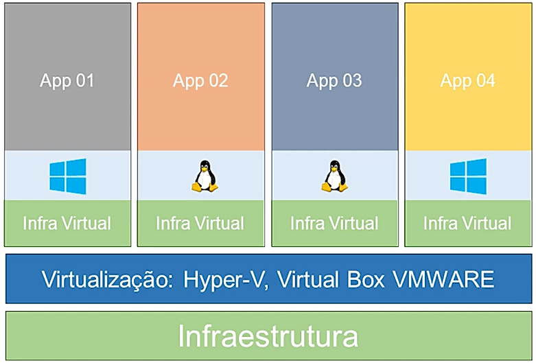
Na virtualização eu tenho como base a minha infraestrutura. Logo assim tenho a virtualização, por cima dela eu tenho a minha infravirtual onde eu escolho quanto de recurso eu vou destinar para cada maquina. Seguindo, temos o sistema operacionar e aplicação.

O grande problema para esse metodo é que, para cada maquina virtual é preciso instalar e gerenciar o sistema operacionar e seus recusros.

# CONTENIZAÇÃO

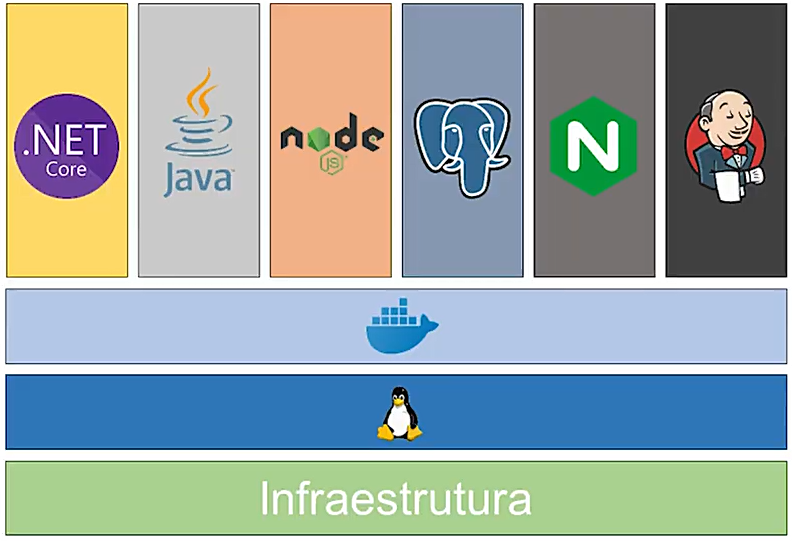

Nesse método, temos a camada de infrastrutura, o sistema operacional e encima dele temos o container Runtime(O CRI vem de Container Runtime Interface, que é um plugin que expõe uma interface que permite que um Kubelet (agent que roda dentro de cada nó dentro de um cluster do Kubernetes) use diferentes tipos de runtime compatíveis com a especificação da OCI sem precisar de recompilação ou reinicialização.) e com ele temos a execução dos containes que executam os processos.

# O QUE SÃO AS IMAGENS?

São os templeates que são gerados para criar e executar um container.

# ARQUITETURA DO DOCKER?

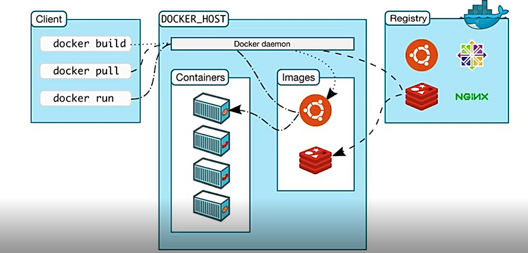

Ele é formado por três componentes. Docker daemon, docker client e docker registry.

<ul>
<li>[ ] Docker daemon

É o componente que gerencia os objetos do docker, como as imagens, os containes, networks e os volumes. E todo o processo de execução dos containers acontece nele.

</li>
<li>[ ] Docker client

E para se comunicar com o docker daemon tem o docker client, que é o docker cli, ferrramenta de linha de comando.

</li>
<li>[ ] Docker registry

É o repositotio de imagens onde se armazena e distribuir as imagens que vão criar e executar os meus containers.

</li>
</ul>

# COMANDOS

<ul>
<li>[x] docker : verificando se está instalado</li>
<li>[x] docker container run <nome-da-imagem>: crinado um container</li>
<li>[x] docker container run --name <nome-do-container> <nome-da-imagem>: crinado um container</li>
<li>[x] docker container ls: listando os containers que estão em execução</li>
<li>[x] docker container ls -a: listando todos containers</li>
<li>[x] docker container rm <id-container>: apagar containers</li>
<li>[x] docker container run -it <nome-da-imagem> /bin/bash : crinado um container no modo interativo</li>
<li>[x] docker container run -d nginx : executando em modo dimo, liberando o terminal</li>
<li>[x] docker container exec -it /bin/bahs : executando o contianer</li>
<li>[x] docker container ls -a -q : devolve os ids dos containers</li>
<li>[x] docker container run -d -p 5432:5432 -e POSTGRES_DB=aula-iniciativa -e POSTGRES_USER=iniciativadevops -e POSTGRES_PASSWORD=123456  postgres : iniciando um container e definindo as variveis de hambiente</li>
<li>[x] docker images -a |  grep "<none>" | awk '{print $3}' | xargs docker rmi : apagando todos as imagens que tem a tag <none></li>

</ul>
<a href="https://www.digitalocean.com/community/tutorials/how-to-remove-docker-images-containers-and-volumes-pt">Mais informações</a>

# CRIANDO O DOCKERFILE

        FROM ubuntu //imagem base
        RUN apt update // atualiza a imagem 
        RUN apt install curl --yes // inatala o pacote curl
<ul>
<li>[x] docker build -t <nome-da-sua-imagem> <contexto> (. ou -f caminho-do-seu-arquivo)</li>
<li>[x] docker build -t <nome-da-sua-imagem> <contexto> --no-cahed</li>
<li>[x] docker image prune : excluir as imagens que não estão sendo usadas</li>
<li>[x] docker tag ubuntu-curl jeovanedos2santos/ubuntu-curl:v1 -> renomeando uma imagem</li>
<li>[x] docker login -> login no docker</li>
<li>[x] docker push <nome-do-repositorio> -> mandando para o docker a sua imagem</li>

</ul>

# OUTROS COMANDOS

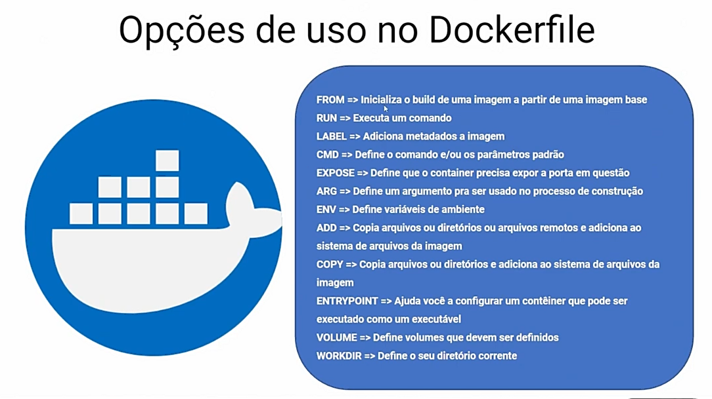

# CAMANDOS

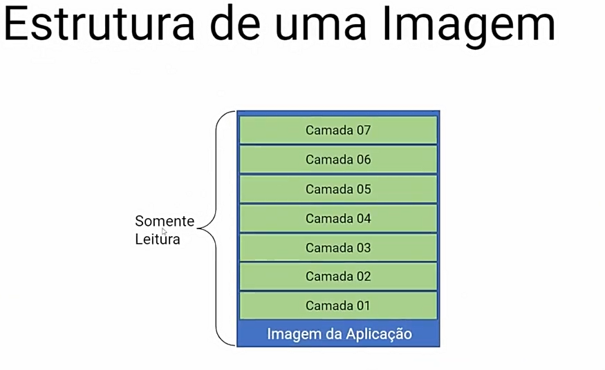
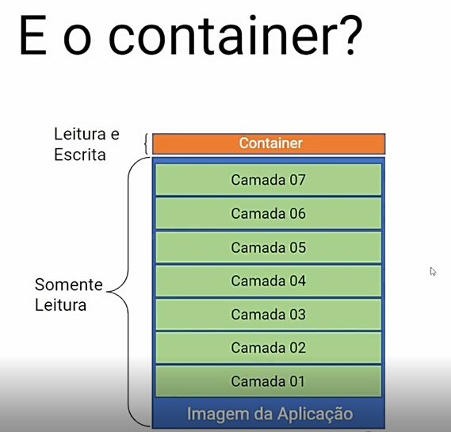
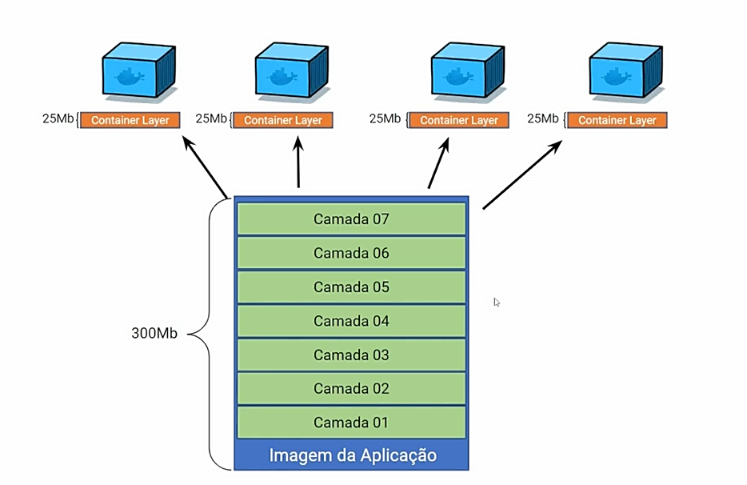

# NOMEANDO SUA IMAGEM 

        Namespace/Repositório:Tag
        jeovanedos2santos/ubuntu-curl:v1

Quando não coloca a tag isso significa que está subindo a versão mais atual

# ARQUIVO DOCKER
<ul>
<li>
<h2>Docker Images</h2>    

        FROM name_imagen:version
 
Aqui estamos usando uma imagem do docker hub. Isto, é um container pré-formatado do docker que permite que você monte sua máquina a partir daquela configuração inicial.
</li>
<li>
<h2>Environment Variables (Variáveis de ambiente)</h2>  
        
        ENV environment_variables
 
Você pode criar todas as variáveis de ambiente que quiser com o ENV.
</li>
<li>
<h2>Run Commands</h2>    

        RUN comando_a_ser_execultado

No RUN você deve passar quais comandos o docker devera executar para que as configurações inicias de um projeto funcione.
Exemplo: npm i, npm install, yarn, npm run start etc. Também pode ser passando comandos de migrate. 
</li>
<li>
<h2>Workdir</h2>    

        WORKDIR caminho_do_diretorio_onde_vai_roda_os_comandos
        
Workdir é uma instrução para mostrar ao docker em qual diretório ele vai rodar os comandos a partir dali.
</li>
<li>
<h2>COPY e ADD</h2>    

Copy e ADD são basicamente a mesma cosia. Ambos copiam um arquivo do seu computador (o Host) dentro do container (o Guest). No meu exemplo, estou apenas copiando o requirements para dentro do docker, para que eu possa dar pip install nos pacotes.
</li>
<li>
<h2>EXPOSE</h2>  

        EXPOSE 8000
        
Expose é para mapear uma porta do Guest (o Container) para o Host (seu computador)
</li>
</ul>

# ARQUIVO DOCKER-COMPONSE
O compose é uma ferramenta para rodar múltiplos containers do docker. Só precisa criar um arquivo yml na pasta do seu projeto com o nome docker-compose.yml

        version: '3.3'

        services:
          # Postgres
          db:
            image: postgres
            environment:
              - POSTGRES_USER=postgres
              - POSTGRES_PASSWORD=postgres
              - POSTGRES_DB=postgres

          web:
            build: .
            command: ["./run_web.sh"]
            volumes:
              - .:/webapps
            ports:
              - "8000:8000"
            links:
              - db
            depends_on:
              - db
<ul>
<li>
<h2>LINKS</h2> 

        links:
          - db
          
Você pode se referir a outro container que pertence ao seu arquivo docker-compose utilizando o nome dele. Como criamos um container com o nome db para o Postgres nós podemos criar um link para ele no nosso container chamado web. Pode ver que no settings.py nós colocamos ‘db‘ como host.
</li>
<li>
<h2>DEPENDS_ON</h2>   

        depends_on:
          - db

Dependência expressa entre serviços.
</li>
<li>
<h2>Command</h2>    
Command é o comando padrão que o docker vai rodar logo depois que você subir, ou seja, colocar os containeres para funcionar.

</li>

</ul>
 
# CRIANDO UM CONTAINER COMO O DOCKER COMPOSE
        
        docker compose up --build -> crinado uma novo container com as imagens

# PRIMEIRO PROJETO: CONVERSÃO DE TEMPERATURA

Dentro do diretorio src crie um arquivo "Dockerfile" e dentro dele coloque os seguintes comandos para definir a sua imagem.

        FROM node:16.15.0           -> imagem base será o node
        WORKDIR /app                -> criar um diretorio app
        COPY ./package*.json ./     -> copia o package.json e o  package-lock.json
        RUN npm install             -> baixa as dependencia do projeto 
        COPY . .                    -> copia o restande dos arquivos
        EXPOSE 8080                 -> definindo a porta que o projeto ira roda
        CMD ["node", "server.js"]   -> definifo os comandos para o projeto roda

Apos execute as seguintes linhas de comandos(execute dentro do diretorio src)

        docker build -t <namespace>/<name-repositorio>:versão
        docker container run -d -p porta-d-sua-maquina:porta-do-container <namespace>/<name-repositorio>:versão

<a href="https://docs.docker.com/get-started/overview/">Documentação do docker</a> 
<a href="https://fernandofreitasalves.com/criando-um-container-docker-para-um-projeto-django-existente/">Mais detalhes</a>
       
 # NEM TUDO SÃO FLORES
        

Para cada solução existe um novo problema. Com o atual cenario de clud e micro-serviçõs é necessario mais do que apenas isolamento de processos para a execução das aplicações.

É preciso carantir que se um container estiver com uma mal funcionameto, é importande que ele seja encerrado e ser criado outro em seu lugar.

E isso o docker não faz. 

É preciso também ser capaz de replicar os containers para distribuir as cargas de requisições entre eles.

E isso o docker não faz. 

Para solucionar esse problema existe o KUBERNETS.

# O que é KUBERNETS?

Kubernetes é um sistema de orquestração de contêineres open-source que automatiza a implantação, o dimensionamento e a gestão de aplicações em contêineres. Ele foi originalmente projetado pelo Google e agora é mantido pela Cloud Native Computing Foundation.

É uma plataforma open source que automatiza as operações dos containers Linux. O Kubernetes elimina grande parte dos processos manuais necessários para implantar e escalar as aplicações em containers.

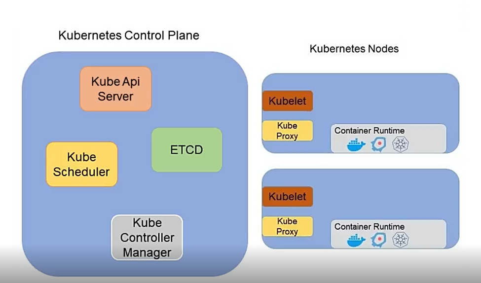

# Kubernetes Control Plane

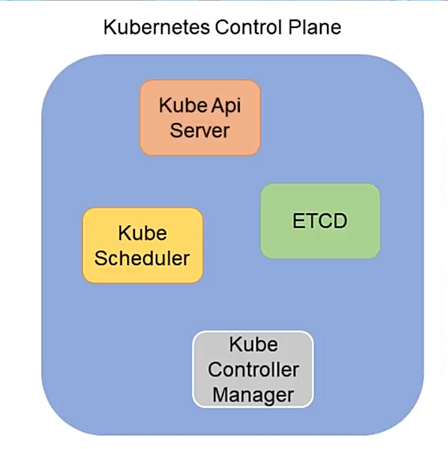

No kubernetes control plane temos as componentes que fazem o gerenciamento do CLUSTER KUBERNETES.

<ul>
<li>
<h2>Kube Api Server</h2>
É responsavel por receber toda a comunicação com o CLUSTER.
</li>
<li>
<h2>ETCD</h2>
É um banco de chave e valor que armazena todos os dados do KUBERNETE.
Nuca é acessado os dados pelo ETCD isso é feito pelo KUBE API SERVER.
</li>
<li>
<h2>Kube Scheduler</h2>
É o componente que determina onde cada container será executado no CLUSTER.
Ele analisa as expecificaçõs e verifica quaid NODE pode atender a certa demanda e define onde ele será executado.
</li>
<li>
<h2>Kube Controller Manager</h2>
Ele executa e gerencia todos os controladores do kubernetes
</li>
</ul>

# O que é um controlado?

Se algo estiver fora do programado o controlador ira atuar para que a apalicação volte ao estado normal.

- ReplicaSet: garante que o número de replica está em conformidade com o que foi determinado
- NodeController: monitora o estado dos CLUSTER e caso algo aconteça ele atua

# Kubenetes Nodes
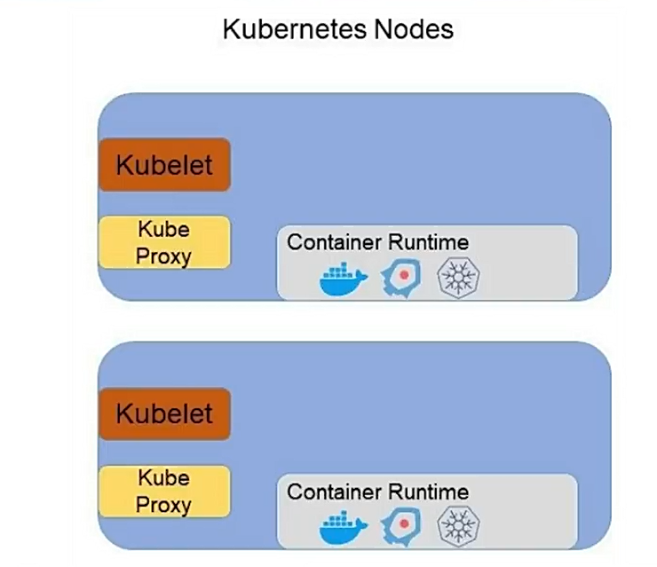
<ul>
<li>
<h2>Kube Proxy</h2>
É responsavel pelas conexões de redes por todo o CLUSTER.
</li>
<li>
<h2>Kubelet</h2>
Atua como um gestor do node, ele é responsavel pela execusção dos containers e interagir com o kuber api server para reportar os status.
O Kubelet usa um contianer runtime compativel com o kubernetes para execuar os containeres.
</li>
</ul>

O kubernetes possui algumas interfaces para uso de softwares de terceiros para algumas tarefas, ganhando flexibilidade e sapara o que é respnsabilidade do kubernetes e o que não é. 

Para gerenciamento de historico no kubernetes temos o Container Storage Interface (CSI) de rede temos Container NetWork Interface (CNI) e para execução de containes temos o Container Runtime Interface (CRI). 

# Como usar o docker e o kubernetes juntos?

Graças ao Open Container Initiative (OCI),um projeto da Linux Foundation, iniciado em junho de 2015 pela Docker, para projetar padrões abertos para virtualização em nível de sistema operacional, principalmente contêineres Linux, é uma estrutura de governança open source com o objetivo de padronizar o formato de criação de imagem e execução de container o docker, container deen e o craior tem o mesmo padrão para executar container e criar imagens. 
Logo eles são compativeis entre se.

# Para saber se já está instadalado execute no seu terminal

        choco install kubernetes-cli
        kubectl -> no seu terminal

Vamos usar o k3d que é usado para abiente de desenvolvimento e para estudos. Para ambiente de produção o mais indicado é o rke.

        choco install k3d

# COMANDOS

        k3d cluster create <nome> -> cria um cluster
        k3d cluster ls -> listar todos os cluster
        k3d cluster delete -> apaga
        kubectl get nodes -> listas os nodes do kubernetes
        k3d cluster create --no-lb -> criar um cluster sem loadbalencer
        k3d cluster create <nome> --servers <quantidade> --agents <quantidade>

# DEPLOY

<ul>
<li>
<h2>POD</h2>
É o menor objeto do cluster kubernetes é nele que se executa os contaniners.
Dentro do POD pode ter mais de um containe, e qunado existe varuis containers dentro dele os containers dividem o mesmo endereço de rede (o mesmo ip) e o mesmo filesysten.
O jeito correto é colocar cada aplicação detro de POD. Como mostra a imgagem abaixo. 

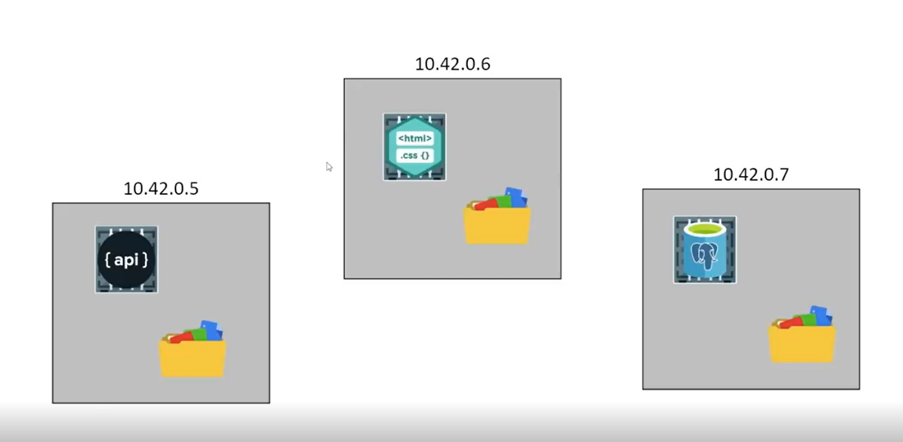

Uma outra solução é criar um container auxiliar cumprindo um requisito não funcional da aplicação. Essa pratica é chamada de SydeCar é muito usado em soluções de Service Mesh.

 -Service Mesh: pode ser definido como uma infra-estrutura dedicada para lidar com um alto volume de tráfego baseado em IPC (inter-processos de comunicação). Em uma arquitetura Microsserviços , é normalmente chamada de tráfego Leste-Oeste.‍

Em poucas palavras, service mesh pode ser considerado uma "camada" de rede abstrata para comunicações de serviços.

Estas abstrações resolvem a maior parte das manipulações da rede como Balanceamento de Carga, Disjuntores, Retries, Timeout, Routing inteligente que pode permitir técnicas avançadas de implantação como Canary Releases, Dark Launches, e outros.

Então, podemos tirar essas responsabilidades de nosso código de aplicação. Além disso, podemos remover estas funções dos desenvolvedores, e isso é muito importante porque os desenvolvedores devem codificar para o negócio, não para os requisitos de infra-estrutura.

Outra característica importante do Service Mesh é a Telemetria, algumas implementações se integram facilmente com Jaeger e Prometheus.

Bibliotecas famosas no ecossistema Java relacionadas com a manipulação de redes como Netflix Ribbon, Hystrix e Eureka podem ser substituídas para as implementações de Service Mesh como ISTIO. <a href="https://br.sensedia.com/post/what-is-service-mesh-and-why-you-should-consider-it">Mais detalhes</a>

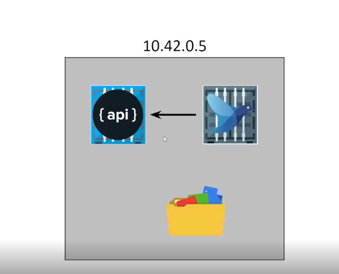

# Criando um POD
Para criar ele é preciso ter um arquivo de manifesto, nesse aquivo tem toda as expecificações quer sera criada no cluster.
<ul>
<li>
<h2>apiVersion</h2>
É o grupo de apis que o tipo de objeto criado irá utilizar.(Indica a versão da API Kubernetes usada para criar o objeto)
</li>
<li>
<h2>kind</h2>
Define o tipo de objeto a ser criado : Pod, Deployment, ReplicaSet, Service, Namespace 
</li>
<li>
<h2>metadata</h2>
Define os dados do objeto como: name, labels, etc. É um dicionário. Tudo dentro do metadata tem que ser indentado a direita, eles são filhos do objeto metadata, e não importa a quantidade de espaços que você use para indentar; o ponto de atenção é que eles tem que ter sempre o mesmo espaçamento para indicar que são campos do mesmo nível.
</li>
<li>
<h2>spec</h2>
 Define as especificações do objeto que desejamos criar e varia conforme o objeto. Também é um dicionário, então precisamos adicionar as propriedades que vão resolver o que você precisa fazer.
</li>

        apiVersion: v1
        kind: Pod
        metadata: 
                name: pod-nginx
        spec:
                containers:
                  - image: cont-nginx
                  name: nginx
                  ports: 
                - containerPort: 80 

Para saber a versão da api faça

        kubectl api-resources
        kubectl api-resources | grep pod
        kubectl apply -f pod.yaml -> aplicando o manifesto
        kubectl get pods -o wide -> mostra mais detalhes
        kubectl describe pod meupod -> mostra toda a descição
        kubectl port-forward pod/<namepod> port:portDoPod -> cria um redirecionamento para o pod
        kubectl delete pod <name-pod>
        kubectl delete -f pod.yaml -> deleta todos os pods que estiverem nesse maifesto
        watch 'kubectl get pods' -> ficara mostrando em tempo real a criação dos pods

<a href="https://macoratti.net/22/04/kubern_ambpd1.htm">Mais detalhes</a>
</ul>
</li>

</ul>

# Labels e Selectore

Conceito: no kubernetes sempre está interagindo com objetos, o ReplicaSet interage com Pod, o  Deployment vai interagir com outros objetos.

# Como é feita essa interação?

Os objetos geramente são marcados com labels, labels são elementos de chave e valor e o selectore será usado para selecionar objetos baseados nessa label.

# Comando

        kubectl get pods -l app=green -> selecionar pod

# ReplicaSet

O pod não tem escabilidade e reciliencia, para isso é preciso um controlador.
Nisso entra o ReplicaSet. 

Como funciona o ReplicaSet? 
É definido o template do pod e também a qua ntidade de replicas. 
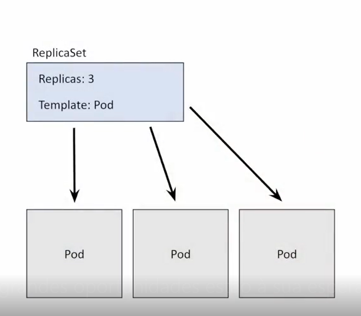 

Se alguma coisa acontecer com algum pod, o ReplicaSet replica outro pod para garantir que existira a quantidade que definida inicialmente.

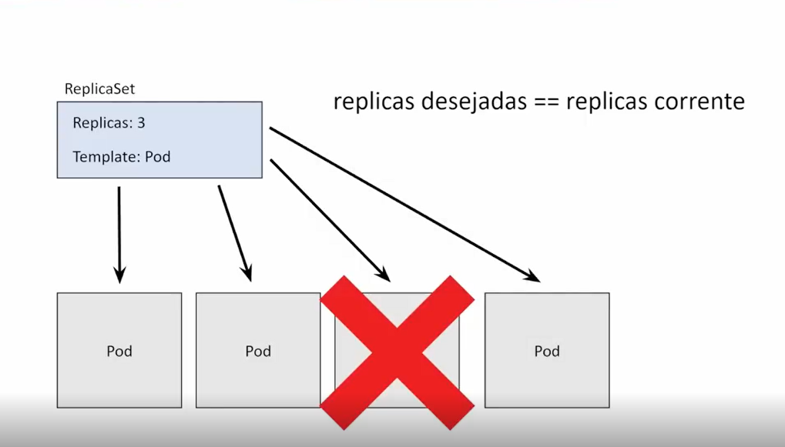

# Deployment

Ele é responsavel pelo versionamento do replicaset. 

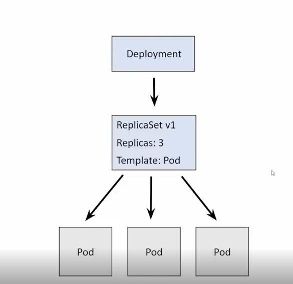

Caso tenha alguma alteração de imagem ou outra epecificação do pod ele criara outro replicaset.

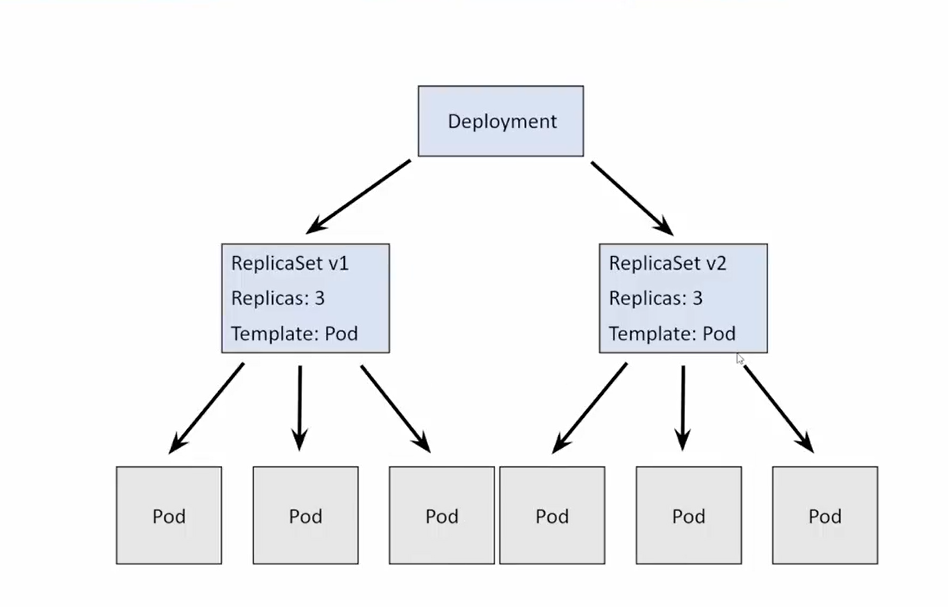

E esse outro replicaset ira ficar no cluster "desabilitado", pois o novo replicaset ira pegar todos os pods antigos e recriara para a versão mais atual.

# Rollback

Kubernetes possui um mecanismo de reversão integrado. Existem várias estratégias quando se trata de implantar aplicativos em produção. No Kubernetes, as atualizações contínuas são a estratégia padrão para atualizar a versão em execução do seu aplicativo . A atualização contínua encerra o Pod anterior e traz o Pod mais novo de forma incremental.

        kubectl rollout history deployment <nome_do_metadata> -> lista as versões existentes
        kubectl rollout undo deployment <nome_do_metadata> -> faz o processo de troca para a versão antiga

# OBS: 
Um problema que aconteceu comigo, ao reiniciar a minha maquina ao executar os comandos do <b>kubectl</b> apresentava o seguintes erro:

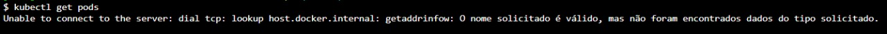

        Unable to connect to the server: dial tcp xxx.xxx.x.xxx:xxxx: connectex: Nenhuma conexão pôde ser feita porque a máquina de destino as recusou ativamente.

Isso se da pois o servido do docker  não está em uso logo no vscode faça o seguinte:

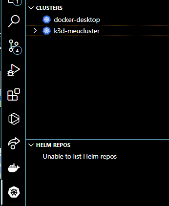
 
Nome da extenção: Kubernetes v1.3.10

Clique com o batão direito do mause sobre <b>docker-desktop</b> e selecione Set as Current Cluster e tente roda os comandos. 
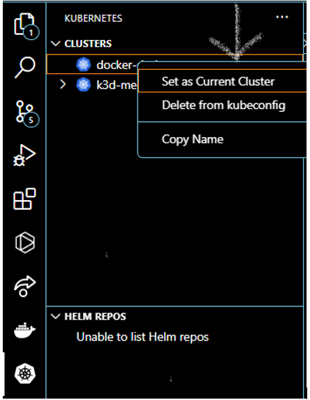

Se não resolver, verifique se no docker desktop se o docker e o kubernetes estão rodando, verificando se estão verdes os dois icone.

# Services

Existe varios tipos de services, vamos ver três deles.

<ul>
<li>
<h2>ClusterIP</h2>
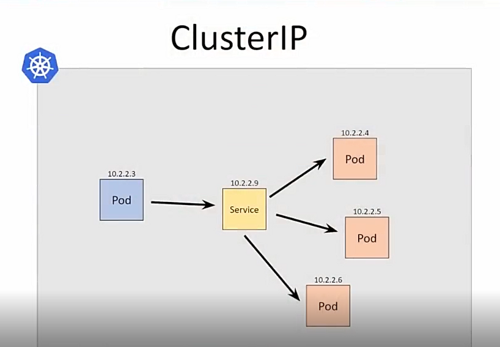

É usado internamente no kubernetes, ele recebe um ip proprio dentro do cluster e ele vai ser o ponto de acesso aos pods internamente no cluster kubernetes.
Com esse service não havera aceeos externo aos pods apenas os pods que tem estão internamentes no cluster kubernetes terão acesso.
</li>
<li>
<h2>NodePort</h2>
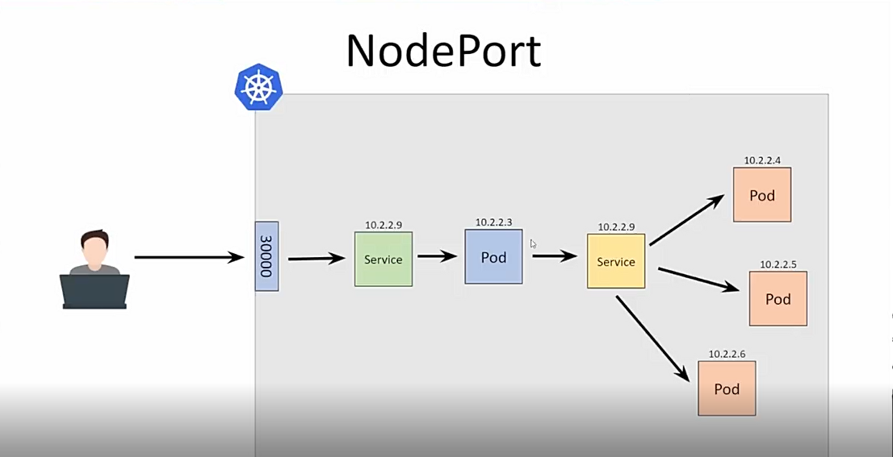

Ele expõe externamente esses pods, porém ele possui uma caracteristica ele usa uma porta de todos os nos do cluster kubernetes ele elege um número de porta, que normalmente por padrão está na ranger da 30000 a 32767.

E ao escolher esse número de porta ele vai expor em todos os nos do cluster kubernetes.

</li>
<li>
<h2>LoadBalancer</h2>
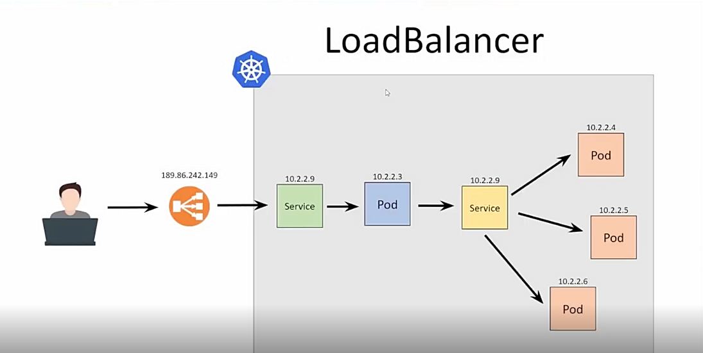

É um service que expoe externamente o meu pod, porém ele utilizar o serviço do cloud provider (Computação em nuvem) onde ele está em execução, normalmente se utiliza o loadbalancer junto com um kubenetes sever as seves conectado a um cloud provider, pois quando é criando esse tipop de service o cloud provider cria um loadbalancer na frente do service gerando um ip externo, sendo através desse ip que será ppossivel acessar os pods.
</li>
<ul>

# Criando um Servidor

        k3d cluster create <nome_do_seu_cluster> --servers 3 --agents 3 -p "30000:30000@loadbalancer"
        kubectl apply -f deployment.yaml

OBS: caso apareça o seguite erro faça o seguinte. 

        Unable to connect to the server: context deadline exceeded (Client.Timeout exceeded while awaiting headers)

1 - Crie um arquivo chamado:

        .wslconfig

na sua pasta de usuario do windows. 

2- Coloque o seguinte codigo dentro dele

        [ws12]
        memory=<coloque aqui a quandidade de memoria RAM que você desja gastar nos processos, repeitando os limite de sua maquina>
        processors=<coloque aqui a quandidade de processadores que deseja destinar para o serviço>

como isso ele vai restarta os serviçõs do docker com essa nova configuração. 

3- Abra seu terminal como adiministrador, digite a seguite linha.

        Restart-Service LxssManager

Apos isso tente criar os services novamente.

# Comandos 

        kubectl get services -> para ver os services criados

# O que é o Terraform?

Terraform é uma ferramenta para criar, alterar e criar versões de infraestrutura com segurança e eficiência. O Terraform pode ajudar com várias nuvens, tendo um único fluxo de trabalho para todas as nuvens. A infraestrutura gerenciada pelo Terraform pode ser hospedada em nuvens públicas, como Amazon Web Services, Microsoft Azure e Google Cloud Platform, ou no local, em nuvens privadas, como VMWare vSphere, OpenStack ou CloudStack. O Terraform trata a infraestrutura como código (infrastructure as code – IaC) para que você nunca precise se preocupar com a sua infraestrutura se distanciando da configuração desejada.

