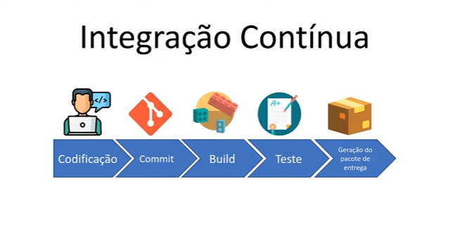

# Pipelines CI/CD com Jenkins

O conceito de de pipeline é a ideia de criar um fluxo de conjuntos de passos ou etapas.

# CI - Integração Contínua 

# CD - Deploy Contínuo

# Resumo

# Jenkins

# Arquitetura do Jenkins

# Instalando o Jenkins

# Projeto

